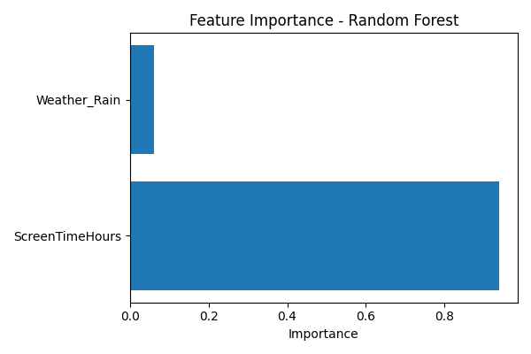
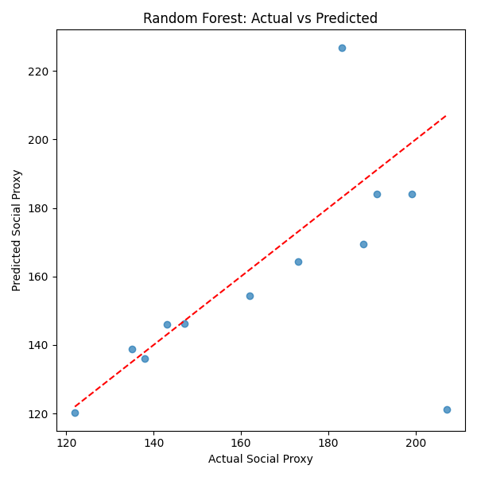

# Screen Time vs. Real-Time Social Activities  

## Project Overview & Methodology

### Hypothesis
- **Null Hypothesis (H0):** There is no significant relationship between screen time and time spent on real-life social activities.
- **Alternative Hypothesis (H1):** Increased screen time is negatively correlated with time spent on real-life social activities.

### Motivation
In today's digital age, people spend a significant portion of their time on screens, which may impact their participation in real-time social activities. This project aims to analyze the relationship between screen time and social engagement to identify patterns and potential behavioral insights.

### Project Goal
The goal of this project is to examine and quantify the potential relationship between digital screen time and social behavior. In particular, we assess whether increased screen usage correlates negatively with real-world social engagement, and whether other contextual factors — such as weather conditions — further modulate this relationship. Through data-driven insights, the project aspires to contribute toward better digital well-being strategies and encourage conscious screen use.

## Data Sources and Preprocessing

### Data Sources
1. **Screen Time Data:** Tracked using the StayFree app on an Android device. Data was exported and cleaned into structured `.csv` format.
2. **Social Activity Data:** Derived from Google Maps Timeline JSON logs, processed into daily ping counts.
3. **Weather Data:** Historical daily weather information was collected from Visual Crossing and categorized as `Rain` or `No Rain`.

### Data Enrichment & Transformation
- Screen time logs were converted into daily totals (in hours)
- Ping data was aggregated into daily counts to represent out-of-home social activity
- Weather text data was filtered to extract rain patterns, later converted into binary features
- All data were merged using the `Date` column to form a unified dataset: `final_dataset_with_weather.csv`

## Exploratory Data Analysis (EDA)
We examined the distribution and variability of screen time and social activity:

- Mean screen time: 4.53 hours
- Mean social activity proxy: 161 ping counts
- Distributions were right-skewed (see histogram below):

A scatter plot also showed a moderately negative relationship between screen time and social activity:

And day-by-day fluctuations were captured with time-series visualization, highlighting how both screen time and social activity shifted over time:

## Statistical Analysis

A linear regression was applied to examine the strength and significance of the relationship:
- **p-value:** 0.00018 → statistically significant at α = 0.05
- **R²:** 0.23 → screen time accounts for 23% of social proxy variance

The downward trend visually and statistically supports our alternative hypothesis.

## Weather Effects

To understand environmental context and its potential confounding influence:

- Daily weather pattern frequencies were visualized using a bar chart:

- And daily conditions were presented using a color-coded timeline chart:

A binary `Weather_Rain` variable was derived and used in further modeling.

## 🧠 Machine Learning

We developed multiple models to predict real-world social engagement, using key features:

- `ScreenTimeHours`: Total hours spent on screen daily  
- `Weather_Rain`: Binary indicator of rainy weather conditions

### 1. Linear Regression
- **Test MSE:** 1279.82  
- **Train R²:** 0.29  

A simple yet informative model capturing a moderate inverse relationship between screen time and outdoor social behavior.

### 2. Random Forest Regressor
- **R² Score:** -0.14  
- **MSE:** 836.51  
- **MAE:** 16.44  

Although the Random Forest model yielded a lower R² score — suggesting weak generalization in this setup — it still produced lower error values (MSE and MAE), indicating better absolute prediction accuracy on this small dataset.

> This suggests the model may be overfitting or that additional features are needed to improve generalizability.

### 🔍 Visualizations

## Accomplishments Summary

-  Fully cleaned & preprocessed dataset with transformed features
-  Performed in-depth EDA and hypothesis testing
-  Generated multiple visualizations across behavior & context
-  Included environmental effects (weather)
-  Applied both linear and ensemble machine learning models with interpretable results

## Interpretation 
Although the initial model employed was a basic linear regression, it yielded meaningful insights. The relationship between screen time and social activity proved to be statistically significant and moderately strong, even with minimal features — suggesting that screen time alone carries predictive value for offline engagement.
To build on these insights, a Random Forest Regressor was also implemented. While the R² score was lower, the model demonstrated lower overall prediction error (MAE and MSE), suggesting improved absolute accuracy despite less generalization. This contrast highlights the trade-off between interpretability and flexibility in machine learning approaches. Rainy days, as expected, were associated with slight decreases in social activity, though their effect remained weaker than that of screen exposure.
Overall, the models validated the initial hypothesis and demonstrated that behavioral data — when paired with contextual features like environmental conditions — can offer valuable patterns, even in small datasets.

## Tools & Technologies
- **Language:** Python
- **Libraries:** Pandas, NumPy, Matplotlib, Statsmodels, scikit-learn
- **Data Storage:** CSV files, Excel spreadsheets

## Conclusion
This project set out to evaluate whether screen time negatively impacts real-life social activity — and our findings support this claim. We tested the null hypothesis that there is no significant relationship, and with a p-value of 0.00018 and a moderate R² from linear regression, the analysis clearly supported the alternative hypothesis.
The Random Forest model added depth by highlighting predictive performance improvements with ensemble methods, especially in terms of reducing absolute error. These insights reinforce the importance of digital balance and encourage more conscious screen use in daily routines — particularly on days with no weather-related constraints.

> Raw data was excluded from this repository due to privacy concerns. 
> All analysis is based on cleaned and transformed datasets available in this project.

