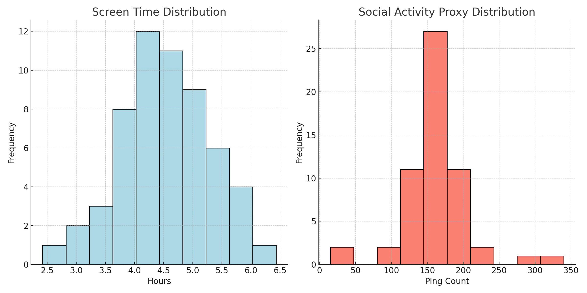
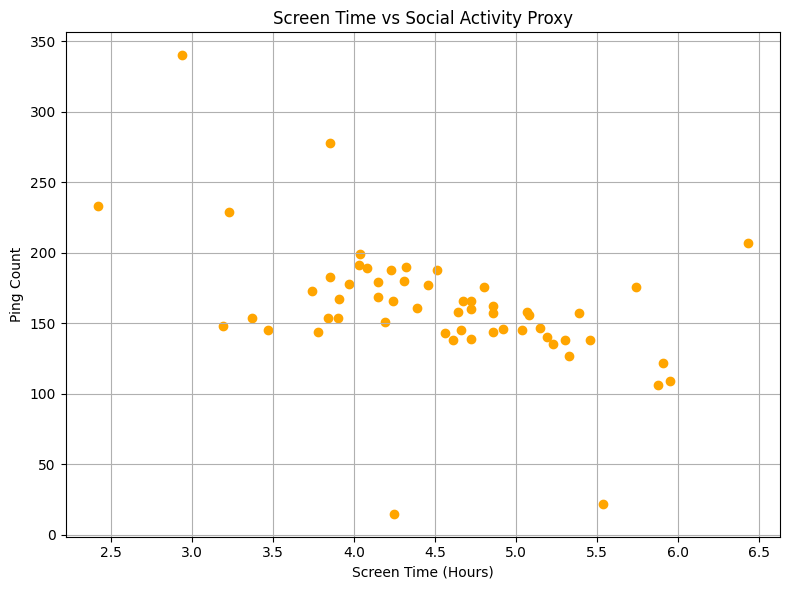
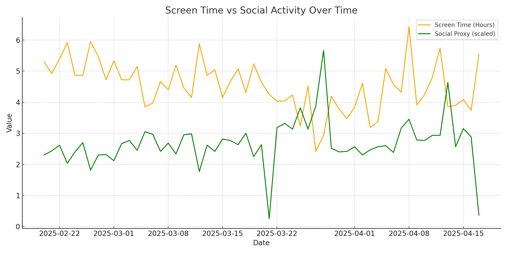
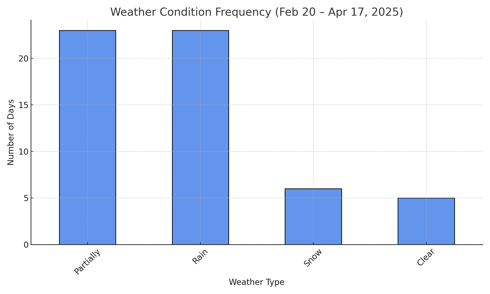
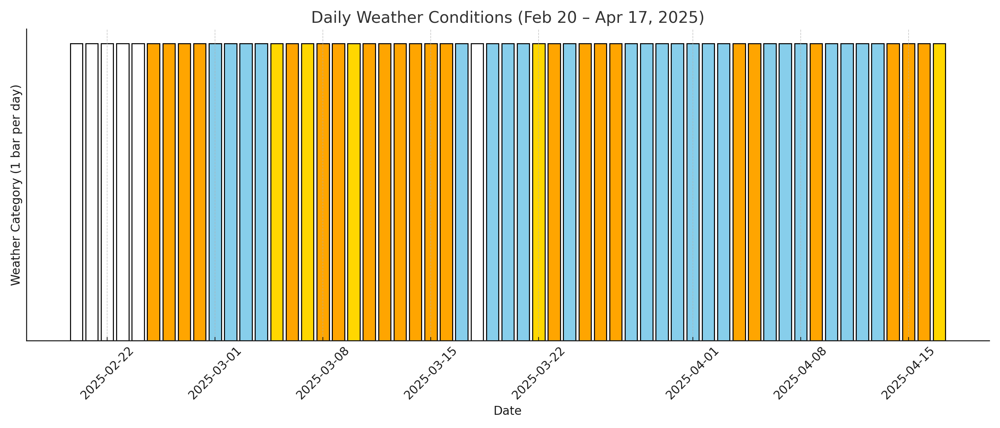

# Screen Time vs. Real-Time Social Activities  

## Project Proposal

### Hypothesis
- **Null Hypothesis (H0):** There is no significant relationship between screen time and time spent on real-life social activities.
- **Alternative Hypothesis (H1):** Increased screen time is negatively correlated with time spent on real-life social activities.

### Motivation
In today's digital age, people spend a significant portion of their time on screens, which may impact their participation in real-time social activities. This project aims to analyze the relationship between screen time and social engagement to identify patterns and potential behavioral insights.

## Data Sources and Preprocessing

### Data Sources
1. **Screen Time Data:** Tracked using the StayFree app on an Android device. Data was exported and cleaned into structured `.csv` format.
2. **Social Activity Data:** Derived from Google Maps Timeline JSON logs, processed into daily ping counts.
3. **Weather Data:** Historical daily weather information was collected from Visual Crossing and categorized as `Rain` or `No Rain`.

### Data Enrichment & Transformation
- Screen time logs were converted into daily totals (in hours)
- Ping data was aggregated into daily counts to represent out-of-home social activity
- Weather text data was filtered to extract rain patterns, later converted into binary features
- All data were merged using the `Date` column to form a unified dataset: `final_dataset_with_weather.csv`

## Exploratory Data Analysis (EDA)
We examined the distribution and variability of screen time and social activity:

- Mean screen time: 4.53 hours
- Mean social activity proxy: 161 ping counts
- Distributions were right-skewed (see histogram below):

A scatter plot also showed a moderately negative relationship between screen time and social activity:

And day-by-day fluctuations were captured with time-series visualization, highlighting how both screen time and social activity shifted over time:

## Statistical Analysis

A linear regression was applied to examine the strength and significance of the relationship:
- **p-value:** 0.00018 → statistically significant at α = 0.05
- **R²:** 0.23 → screen time accounts for 23% of social proxy variance

The downward trend visually and statistically supports our alternative hypothesis.

## Weather Effects

To understand environmental context and its potential confounding influence:

- Daily weather pattern frequencies were visualized using a bar chart:

- And daily conditions were presented using a color-coded timeline chart:

A binary `Weather_Rain` variable was derived and used in further modeling.

## Machine Learning

We developed a Linear Regression model to predict social engagement using:
- `ScreenTimeHours`
- `Weather_Rain`

**Model Performance:**
- **Test MSE:** 1279.82
- **Train R²:** 0.29

While relatively simple, the model captured moderate predictive value, affirming screen time and environmental factors as relevant variables.

## Accomplishments Summary

- ✅ Fully cleaned & preprocessed dataset with transformed features
- ✅ Performed in-depth EDA and hypothesis testing
- ✅ Generated multiple visualizations across behavior & context
- ✅ Included environmental effects (weather)
- ✅ Applied machine learning with interpretable model

## Tools & Technologies
- **Language:** Python
- **Libraries:** Pandas, NumPy, Matplotlib, Statsmodels, scikit-learn
- **Data Storage:** CSV files, Excel spreadsheets

## Conclusion
This project supports the hypothesis that increased screen time is moderately associated with decreased social activity. Rainy weather also contributes as a suppressing factor. These findings highlight the interaction between digital and offline behavior and promote awareness for digital balance strategies.

